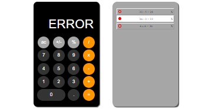

<h1 align="center">«Calculator»</h1>

<h2>Descripion</h2>
 Created simple calculator and logs block.

1. Main calculator features:
   - Numbers should be displayed on screen when you click on number button.
   - When you select one operator, then another, the second one should replace first one on the screen.
   - When you try to divide on 0, the ‘ERROR’ should be displayed on screen.
   - When you click on ‘C’ – you need to clear screen to default value.
   - When you click on ‘=’ – you need to display result on screen and show equation in logs block.

2. Main logs block features:
   - Logs line contains empty circle, equation and close sign.
   - When you hover on circle or close icon they should be red color.
   - When there are too many logs you should show scroll.
   - You should show Scroll Top value in the console only while scrolling logs block.
   - When clicking on circle you should toggle its colorю
   - Add filter in logs: when equation contains ‘48’ – underline it.
   - When you receive ‘ERROR’ on screen, you should not display the equation in logs block.
   - When you click on close icon you should remove log

<h2>Technologies</h2>

+ HTML
+ SCSS
+ JavaScript
+ jQuery 
+ Grid 

<h3 align="center"><a href="https://drozdovdenys.github.io/calculator/">SEE LIVE</a></h3>
